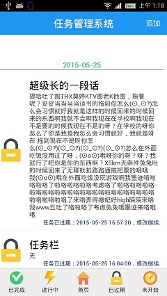
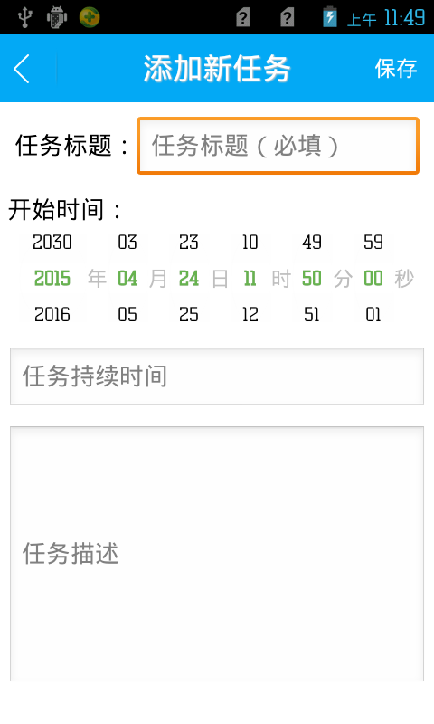
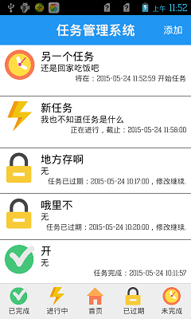
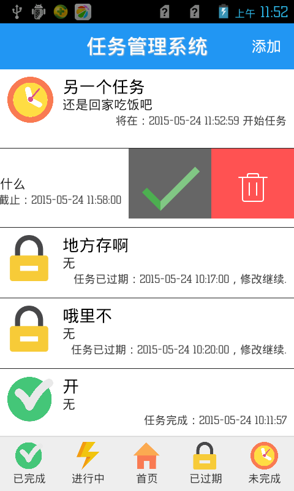
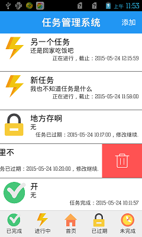
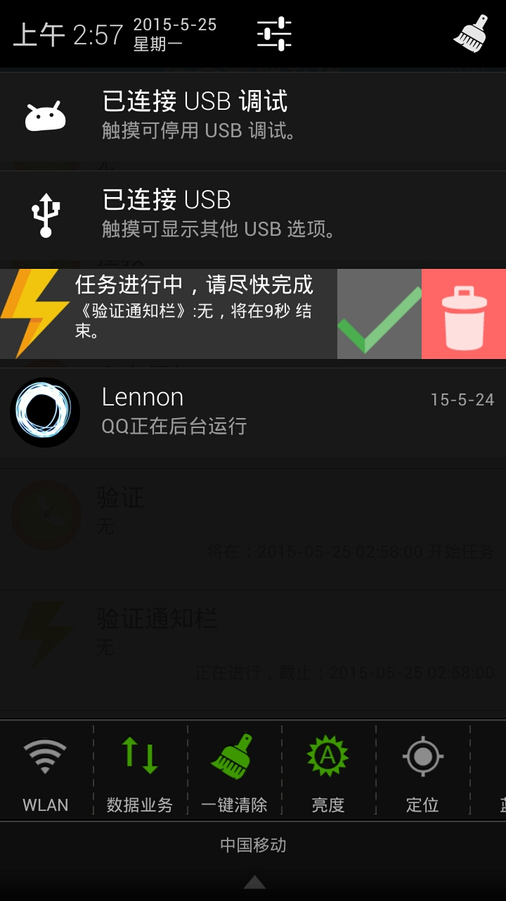
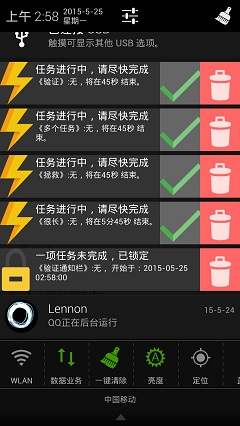
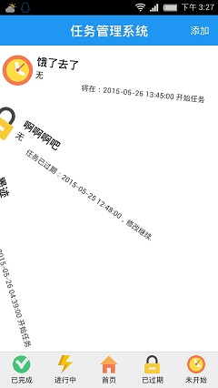

# TaskManagerMaster
一个Android的任务管理器（Task Manager Master, TMM）。将一项任务分成待完成、已完成、正在做、未完成四个类别，方便日程生活中的管理

# 截图

你可以在这里下载安装程序 [download](https://raw.githubusercontent.com/csulennon/TaskManagerMaster/master/bin/taskmanagermaster.apk)

License
-------
 Copyright 2015 csulennon

    Licensed under the Apache License, Version 2.0 (the "License");
    you may not use this file except in compliance with the License.
    You may obtain a copy of the License at

        http://www.apache.org/licenses/LICENSE-2.0

    Unless required by applicable law or agreed to in writing, software
    distributed under the License is distributed on an "AS IS" BASIS,
    WITHOUT WARRANTIES OR CONDITIONS OF ANY KIND, either express or implied.
    See the License for the specific language governing permissions and
    limitations under the License.

